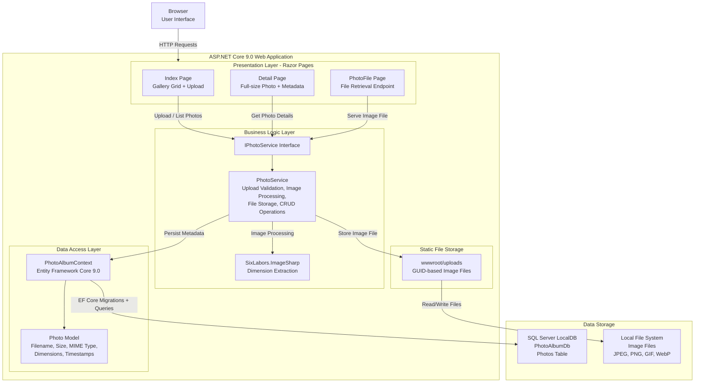

# Architecture Diagram

PhotoAlbum is an ASP.NET Core 9.0 Razor Pages web application for managing and displaying photo galleries.

## Application Architecture

```mermaid
flowchart TD
    Browser["Browser\nUser Interface"]

    subgraph WebApp["ASP.NET Core 9.0 Web Application"]
        subgraph Pages["Presentation Layer - Razor Pages"]
            Index["Index Page\nGallery Grid + Upload"]
            Detail["Detail Page\nFull-size Photo + Metadata"]
            PhotoFile["PhotoFile Page\nFile Retrieval Endpoint"]
        end

        subgraph Services["Business Logic Layer"]
            IPhotoService["IPhotoService Interface"]
            PhotoService["PhotoService\nUpload Validation, Image Processing,\nFile Storage, CRUD Operations"]
            ImageSharp["SixLabors.ImageSharp\nDimension Extraction"]
        end

        subgraph Data["Data Access Layer"]
            PhotoAlbumContext["PhotoAlbumContext\nEntity Framework Core 9.0"]
            PhotoModel["Photo Model\nFilename, Size, MIME Type,\nDimensions, Timestamps"]
        end

        subgraph StaticFiles["Static File Storage"]
            UploadsDir["wwwroot/uploads\nGUID-based Image Files"]
        end
    end

    subgraph Storage["Data Storage"]
        SQLServer["SQL Server LocalDB\nPhotoAlbumDb\nPhotos Table"]
        FileSystem["Local File System\nImage Files\nJPEG, PNG, GIF, WebP"]
    end

    Browser -->|"HTTP Requests"| Pages
    Index -->|"Upload / List Photos"| IPhotoService
    Detail -->|"Get Photo Details"| IPhotoService
    PhotoFile -->|"Serve Image File"| IPhotoService
    IPhotoService --> PhotoService
    PhotoService -->|"Image Processing"| ImageSharp
    PhotoService -->|"Persist Metadata"| PhotoAlbumContext
    PhotoService -->|"Store Image File"| UploadsDir
    PhotoAlbumContext -->|"EF Core Migrations + Queries"| SQLServer
    UploadsDir -->|"Read/Write Files"| FileSystem
    PhotoAlbumContext --> PhotoModel
```
