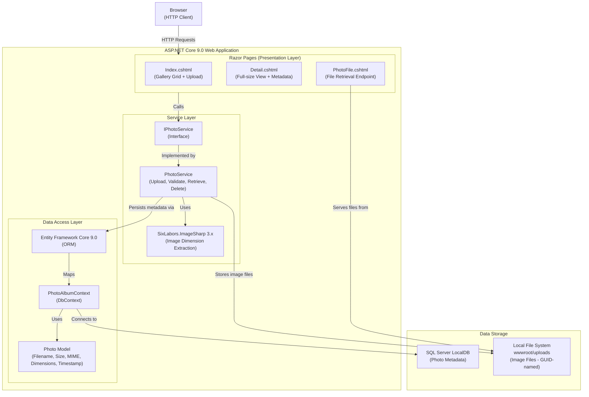

# Architecture Diagram

PhotoAlbum is an ASP.NET Core 9.0 Razor Pages web application for photo gallery management, using SQL Server LocalDB for metadata persistence and local file system storage for uploaded images.

## Application Architecture

